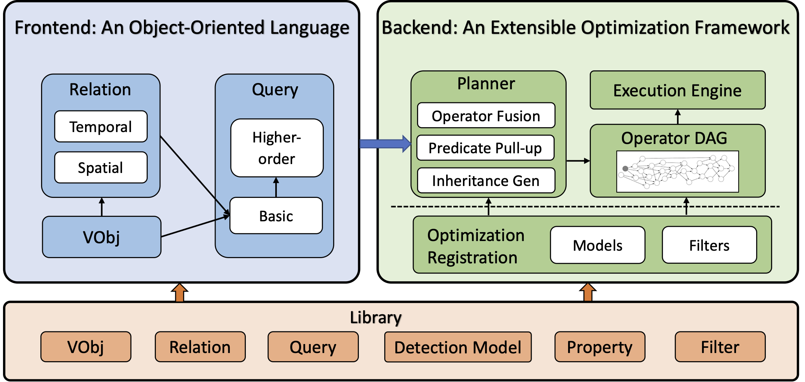

# VQPy: An Object-Oriented Approach to Modern Video Analytics

[](https://github.com/uclasystem/VQPy/blob/main/LICENSE)
[](https://arxiv.org/abs/2311.01623)


VQPy is a Python-based video analytics library, designed to address two major issues in today's video analytics. 

- The logic of typical video queries focuses on video objects (e.g., human and cars) and their interactions; it is often awkward to express such logic with a SQL-like language that builds on structured data, a data model fundamentally different from objects and relations.
- A video pipeline often consists of multiple fragments each involving a different vision algorithm or NN. It is challenging to connect these fragments and orchestrate them in a natural flow with little human effort.

Building on the insight of object orientation, VQPy solves these problems by presenting a <b> video-object-oriented</b> view to analytics developers.  VQPy allows a complex query to be expressed with a very small number of lines of code. VQPy supports query sharing and composition---finding a red car can build on an existing query that finds a general car; monitoring traffic for a city can build on car monitoring queries built for individual districts and intersections, thereby significantly simplifying development and deployment. VQPy allows different objects and relations to be registered with different trackers and detectors,  connecting different fragments of a pipeline naturally with object-oriented constructs such as inheritance and encapsulation. 

Please check out our examples below for details. 

The development of VQPy was initiated by [Harry Xu](http://www.cs.ucla.edu/~harryxu)'s group at UCLA, and has evolved over time into a community effort, involving folks from both academia and industry. VQPy is now part of Cisco's [DeepVision platform](https://research.cisco.com/research-projects/deep-vision) which is deployed world-wide to support complex queries over customer videos.

## Installation

<details><summary>Show installation details</summary>
<p>

### Conda

VQPy is developed and tested on Linux. Therefore we highly recommend you to try VQPy on Linux, to avoid encountering some unknown errors.

You can follow the steps below to install VQPy.

#### Step 0: install conda
We recommend using [conda](https://docs.conda.io/projects/conda/en/latest/user-guide/install/) to prepare the Python environment as follows:
```shell
conda create -n vqpy python=3.8  # "vqpy" is the conda environment name, you can use any name you like.
conda activate vqpy
```

#### Step 1: install VQPy
We haven't published VQPy to Pypi yet. You can use the commands below to install VQPy from Github.
```shell
pip install torch torchvision numpy==1.23.5 cython
pip install 'vqpy @ git+https://github.com/vqpy/vqpy.git'
```

#### Step 2: test installation
You can test whether VQPy has been successfully installed with
```python
import vqpy
from vqpy import query
```

### Docker

You can also try running VQPy in a Docker container by following the below steps.

#### Step 0: prerequisites
You need to have Docker installed on your system (you can download Docker [here](https://www.docker.com/get-started/))

You also need to clone the VQPy code repository into your local (since we need to build a docker image).

#### Step 1: Build the Docker image
Navigate to the directory containing the Dockerfile and use the docker build command to build your Docker image. Replace vqpy_image with the name you want to give to your Docker image.
```shell
docker build -t vqpy_image .
```

#### Step 2: Run the docker container
After building the image, you can run the container with the docker run command. This command creates a new Docker container from the Docker image and starts it. Replace vqpy_container with the name you want to give to your Docker container.
```shell
docker run -it --name vqpy_container vqpy_image /bin/bash
```
</p>
</details>

## Overview
Below is an architecture graph that describes the VQPy framework.
<p align="center">
  
</p>

VQPy's frontend is an object-oriented language that allows users to express their video queries in a natural way. VQPy extends Python's object-oriented programming with a set of video query-specific constructs, including `VObj`, `Relation`, and `Query`.

VQPy's backend framework is an extensible optimization framework, that allows users to easily register their own models and functions, and automatically selects the best plan to execute the query, within user user-specified budget (e.g. accuracy, inference time, etc.).

VQPy also provides a library containing rich models and property functions that help save users' efforts to build queries.


## Usage

### How to query on a video object?
In order to declare a query on a video object with VQPy, users need to extend two classes defined in VQPy, namely `Query` and `VObj`. `VObj` defines the objects of interest (e.g., vehicle, person, animal, etc.), and `Query` defines the video query.

#### Step 1. Define a `VObj`

Users can define their own objects of interest, as well as the properties in the objects they hope to query, with a `VObj` class. 

To define a `VObj` class, users are required to inherit the `VObjBase` class. To define a property of the `VObj`, users can decorate the property with a `@vqpy_property` decorator, with the dependencies of the property as the `inputs` argument. The `inputs` argument is a dictionary of property names and the history lengths of the properties. 

The below example shows how to declare an object of interest `Vehicle` with a property `velocity` that is calculated based on the this and last frame's `tlbr` property of the `Vehicle` object, and a property `license_plate` that is calculated based on the current frame's `image` property of the `Vehicle` object.

```python
from vqpy.frontend.vobj import VObjBase, vobj_property

class Vehicle(VObjBase):

    @vobj_property(inputs={"tlbr": 1})
    def velocity(self, tlbr):
        # calculate velocity based on tlbr
        pass

    @vobj_property(inputs={"image": 0})
    def license_plate(self, image):
        # inference license_plate based on the car image
        pass
```


#### Step 2. Define a `Query`

Users can define video query with a `Query` class that inherits the `QueryBase` class. VQPy introduces two methods for users to express the query logic, i.e. `frame_constraint` and `frame_output`, where users can define the constraints and outputs of the query on frame respectively.

The below example shows how to declare a query that lists the license plates of vehicles that are moving faster than 60 km/h.

```python
from vqpy.frontend.query import QueryBase

class SpeedTicketing(QueryBase):
    def __init__(self):
        self.speed_limit = 60
        self.vehicle = Vehicle()

    def frame_constraint(self):
        return self.vehicle.velocity > self.speed_limit

    def frame_output(self, frame):
        return (self.vehicle.track_id,
                self.vehicle.license_plate)
```

#### Step 3. Initialize and run the query

After defining the `VObj` and `Query`, users can initialize the query executor with `vqpy.init`, and execute the query with the `vqpy.run` function.

```python
import vqpy 

# initialize the query executor
query_executor = vqpy.init(
    video_path="path/to/video.mp4",
    query_obj=SpeedTicketing(),
)

# execute the query
vqpy.run(query_executor)
```

### How to write a video query with inheritance?
VQPy supports both inheritances for `VObj` and `Query`. Users can define a `VObj` or `Query` by inheriting from an existing `VObj` or `Query` class, and easily reuse the properties and logic defined in the parent class.

The below example shows how to define a `Car` `VObj` that inherits from the `Vehicle` `VObj` defined in the previous example, with a `make` property. And both the properties defined in the parent `Vehicle` class and the `make` property defined in the `Car` class can be used in queries on the `Car` `VObj`.

```python
class Car(Vehicle):

    @vobj_property(inputs={"image": 0})
    def make(self, image):
        pass
```

A specific `FindAmberAlertCar` query can be defined by inheriting a general `FindCar` query.

```python

class FindCar(QueryBase):
    def __init__(self):
        self.car = Car()

    def frame_constraint(self):
        return self.car


class FindAmberAlertCar(FindCar):
    def frame_constraint(self):
        return super().frame_constraint() & \
         self.car.make == "Toyota" & \
         self.car.license_plate in amber_alert_list

    def frame_output(self, frame):
        return (self.car.track_id,
                self.car.license_plate)
```

## Examples

We have included several real-world video analytics examples for demonstrating VQPy.

- [People Loitering](examples/loitering): Detects and sends alerts when individuals loiter in designated areas beyond set time thresholds. ([DeepVision Demo](examples/loitering/demo.assets/loitering-vqpy-DV-demo.gif))
- [Queue Analysis](examples/queue_analysis/): Analyze queue metrics such as the number of people waiting, average/min/max waiting times, etc. ([DeepVision Demo](examples/queue_analysis/demo.assets/vqpy-DeepVision.gif))
- [Fall Detection](examples/fall_detection): Recognize fallen people in a video.
- [List red moving vehicle](examples/list_red_moving_vehicle): show the license plates of red moving vehicles.
- [People Counting](examples/people_counting): count the number of people heading in different directions.
- [Unattended Baggage Detection](examples/unattended_baggage): detect unattended baggages.

## Getting Support

- Use VQPy's [slack channel](https://join.slack.com/t/vqpy/shared_invite/zt-1mnq3uh9v-o2~uNUnRQRudNTrYCNHeUA) to ask questions and share ideas!
- Create a GitHub [issue](https://github.com/vqpy/vqpy/issues).

## Acknowledgements

We are grateful for the generous support from:

| 

