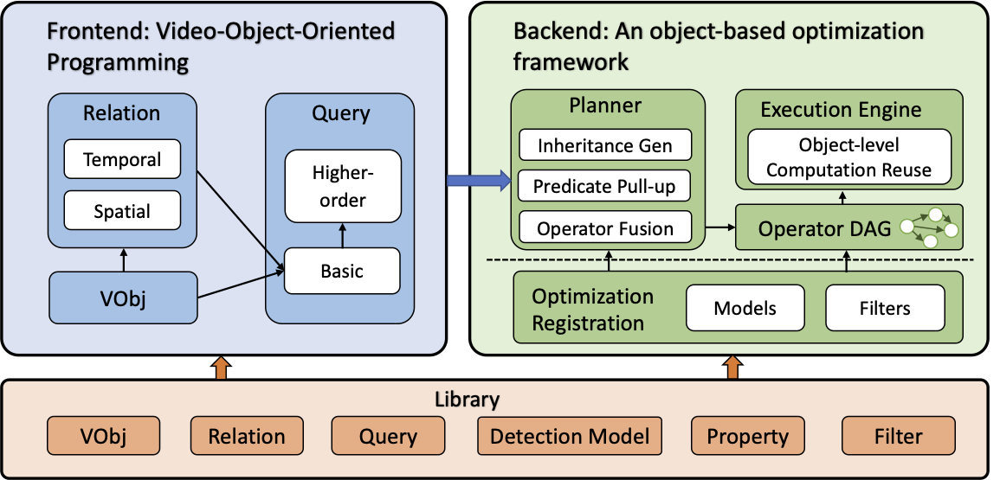

# VQPy : An Object-Oriented Approach to Modern Video Analytics

[](https://github.com/uclasystem/VQPy/blob/main/LICENSE)

VQPy is an object-oriented language, designed to address two major issues in video analytics: (1) it is hard to express complex query logic with a pure declarative language (like SQL) and perform actions (e.g., send a message) when certain events are detected (e.g., a senior person falls) and (2) it is hard to ``grow'' queries in similar ways to how an object-oriented language (such as Java) allows its programs to build on top of each other (check out Guy Steel's OOPSLA'98 keynote on [growing a language](https://www.youtube.com/watch?v=lw6TaiXzHAE)).  

To solve these problems, VQPy embraces the four pillars of object-orientation: <b>Inheritance</b>, <b>Polymorphism</b>, <b>Encapsulation</b>, and <b>Abstraction</b>, with syntax designed specifically for analyzing video frames.  VQPy allows a complex query to be expressed with a very small number of lines of code. VQPy supports query sharing and composition---finding a red car can build on an existing query that finds a general car, thereby significantly simplifying development and deployment. Please check out our examples below for details. 

VQPy is still under active development. VQPy compiler, which generates a query plan with optimized performance for users' video analytics applications, is working in progress. With VQPy compiler, users can simply focus on the declaration of video queries for their own applications, and multiple optimizations defined in the compiler will be transparently applied to the user’s video analytics pipeline.  

## Installation

<details><summary>Show installation details</summary>
<p>

We have not supported installing VQPy automatically yet. You can follow the steps below to install VQPy manually.

We recommend using [conda](https://docs.conda.io/projects/conda/en/latest/user-guide/install/) to prepare the Python environment as follows:
```shell
conda create -n vqpy python=3.8  # "vqpy" is conda environment name, you can use any name you like.
conda activate vqpy
```

#### Step 1: install VQPy from source
You can run below commands to clone vqpy repository and install.
```shell
git clone https://github.com/vqpy/vqpy.git
cd vqpy
pip install -e .
```

#### Step 2: install VQPy model zoo dependency
You can run the `download_models.sh` script to download and install the models in vqpy model zoo, including yolox, license plate detection models.
```shell
./download_models.sh
```
If you are not interested in querying on vehicles and don't want to download models for vehicle, you can run
```shell
./download_models.sh false
```

#### Step 3: test installation

You can test the installation with
```python
import vqpy
```
</p>
</details>

## Overview
Below is an architecture graph which describes VQPy framework.
<p align="center">
  
</p>

In frontend, we provide interfaces for users to declare their query, i.e `VObj` and `Query`.

In backend, vqpy automatically select the best plan to execute the query, within user specified budget (e.g. accuracy, inference time, .etc).

VQPy also provides a library containing rich models and property functions that help save users' efforts to build queries.

Note that users can also register their own models and functions to vqpy library, to enable reusability between different queries and customize their own end to end video query pipeline.

## Quick Start

### Basic usage

In order to declare a video query with VQPy, users need to extend two classes defined in VQPy, namely `Query` and `VObj`. `VObj` defines the objects of interest (e.g., cars, humans, animals, etc.) in one or more video streams, and `Query` defines the video query.  

#### Step 1. Define a `VObj`

Users can define their own objects of interest, as well as the property in the objects they hope to query on, with a `VObj` class. 

To define a `VObj` class, users are required to inherit the `vqpy.VObjBase` class. User can also define properties in the `VObj` that can be used in query (like "license plate" of a "Vehicle"). To define a property, the definition should start either with a `@vqpy.property` decorator or a `@vqpy.cross_object_property` decorator, where `@vqpy.property` indicates that the calculation of the property only based on the attributes of **the VObj instance**, and `@vqpy.cross_vobj_property` indicates that the calculation of the property requires the arributes of **other Vobj instances** on the same frame.

For example,  if we are interested in the vehicle object in the video, and want to query the license plate. We can define a `Vehicle` class as below.

```python
class Vehicle(vqpy.VObjBase):

    @vqpy.property()
    def license_plate(self):
        # infer license plate with vqpy built-in openalpr model
        return self.infer('license_plate', {'license_plate': 'openalpr'})
```

And if we want to query the owner of a baggage object, where the baggage's owner is a person object who is closest to the baggage. We can define our interested `VObj`s as below. Note that the `owner` property of `Baggage` `VObj` should be decorcated with `@vqpy.cross_vobj_property`.

```python
class Person(vqpy.VObjBase):
    pass

class Baggage(vqpy.VObjBase):

    @vqpy.cross_vobj_property(vobj_type=Person, vobj_num="ALL", vobj_input_fields=("track_id", "tlbr"))
    def owner(self, person_id_tlbrs):
        pass
```

To retrieve the attribute values in property calculation, you can use `self.getv("property_name", index={history_index})` or `self.infer`. For more information about how to retrieve attribute values in VObj, you can refer to document [here](docs/frontend.md#retrieve-property-value-in-vobj).

You can find more details about `VObj` as well as the decorators in our [VObj API document](vqpy/obj/vobj/base.py) and [VObj decorator API document](vqpy/obj/vobj/wrappers.py) (Currently is the docstring in our source code).


#### Step 2. Define a `Query`

Users can express their queries through SQL-like constraints with `VObjConstraint`, which is a return value of the `setting` method in their `Query` class. In `VObjConstraint`, users can specify query constraints on the interested `VObj` with `filter_cons`, and `select_cons` gives the projection of the properties the query shall return.

Note that the keys for both `filter_cons` and `select_cons` should be strings of property names, where the property name can either be a vqpy built-in property name or a user declared property name of the interested `VObj`. The value of `filter_cons` dictionary should be a boolean function, the `VObj` instances which satisfy all the boolean functions in `filter_cons` will be selected as query results. The value of `select_cons` dictionary is the postprocessing function applied on the property for query output. If you want to directly output the property value without any postprocessing functions, you can just set the value to `None.`

The code below demonstrates a query that selects all the `Vehicle` objects whose velocity is greater than 0.1, and chooses the two properties of `track_id`  and `license_plate` as outputs.

```python
class ListMovingVehicle(vqpy.QueryBase):

    @staticmethod
    def setting() -> vqpy.VObjConstraint:
        filter_cons = {'__class__': lambda x: x == Vehicle,
                       'velocity': lambda x: x >= 0.1}
        select_cons = {'track_id': None,
                       'license_plate': None}
        return vqpy.VObjConstraint(filter_cons=filter_cons,
                                   select_cons=select_cons)
```

We also provide boolean functions that can be used in query, like `vqpy.query.continuing`, which checks whether a condition function continues to be true for a certain duration. For the detailed usage, please refer to our [People Loitering](examples/loitering) example.

#### Step 3. Launch the task

After declaring `VObj` and `Query`, users should call the `vqpy.launch` function to deploy the video query, below is an example of this interface. Users should specify the detection class they expect, and map the object detection result to the defined VObj types.

```python
vqpy.launch(cls_name=vqpy.COCO_CLASSES, # detection class
            cls_type={"car": Vehicle, "truck": Vehicle}, # mappings from detection class to VObj
            tasks=[ListMovingVehicle()], # a list of Queries to apply
            video_path=args.path, # the path of the queried video
            save_folder=args.save_folder # result of query will be saved as a json file in this folder
            )
```

Under the hood, VQPy will automatically select an object detection model that outputs the specified `cls_name`, and decide the best predicates order to execute the query. Multiple video optimizations will be conducted transparently to improve the end-to-end video query performance.

### Advanced Usage

We also support customize components (e.g. detector) to build the end to end query pipeline. For more details on customization, please refer to the document [here](docs/customization.md).

## Examples

We have included several real-world video analytics examples for demonstrating VQPy.

- [Fall Detection](examples/fall_detection): detect people in the video and recognize fallen person.
- [List red moving vehicle](examples/list_red_moving_vehicle): show license plate of red moving vehicle.
- [People Loitering](examples/loitering): detect suspicious activity of person loitering around.
- [People Counting](examples/people_counting): count the number of person heading different directions.
- [Unattended Baggage Detection](examples/unattended_baggage): detect unattended baggages.

## Getting Support

- Welcome to [join vqpy slack](https://join.slack.com/t/vqpy/shared_invite/zt-1mnq3uh9v-o2~uNUnRQRudNTrYCNHeUA) to ask questions and share ideas!
- Create a github [issue](https://github.com/vqpy/vqpy/issues) to vqpy.
