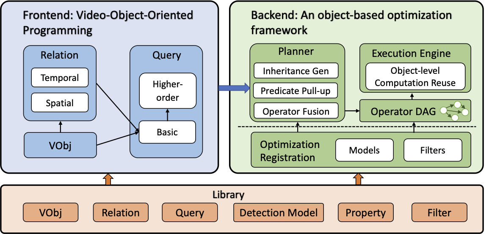

# Frontend Document

This document will go through how to implement a task and how to use the features with VQPy frontend.

## Implement your own task

Before discussing the implementation, you should first import our package, which is

```python
import vqpy
```

First, the overall component of VQPy is shown in the graph below. Note that the frontend and backend are decomposed, and user do not need to care about the backend implementation. In VQPy, launch a task is equivalent to apply a list of queries to the concerned objects detected from video. Hence, to write your own task, you are required to declare your own `VObj` and `Query` classes. We will discuss the steps one by one.

<center>  </center>

### Define a `VObj`

To define a `VObj` instance, you are required to inherit the `vqpy.VObjBase` class, or a subclass of the base class. To refer to the details of this base class, please refer to `docs/v0.1.0/vobj.md`(TODO) or the source code `base/vqpy_base.py`.

The basic component of video object is property. These properties are some values related to the object, like the license plate for the vehicles. One can declare a property using `@vqpy.property()` decorator, and declare a cross-frame property using `@vqpy.stateful()` decorator. The optional parameter in the later decorator denote the number of frames for an instance to be able to get access. There are also some pre-defined postprocess functions, which can be used as syntax sugar by using `@vqpy.postproc()`. For detailed of these decorators, please refer to `docs/v0.1.0/feature.md` (TODO) or the source code `base/feat.py`.

```python
class Vehicle(vqpy.VObjBase):
    """The class of vehicles"""
    required_fields = ['class_id', 'tlbr']

    @vqpy.property()
    @vqpy.postproc({'majority': 100})
    def license_plate(self):
        """The license plate of the vehicle"""
        return self.infer('license_plate', {'license_plate': 'openalpr'})
```

After the inheritance, you can get access to two basic interfaces. Both `getv` and `infer` are inferring an attribute of the video object. This attribute can be either the user-defined property, the video stream information and the library-defined properties (in property library). Currently, the specification should be a dictionary, which provide a string hint to the backend.

```python
class VObjBase:
    def getv(self,
             attr: str,
             index: int = -1,
             specifications: Optional[Dict[str, str]] = None):
        """
        Input:
        attr: the name of the attribute to infer.
        index: FRAMEID_TOINFER - FRAMEID_NOW - 1.
        specifications: (AttributeName -> HintName) dictionary as hint.

        Output:
        return: the inferred value when applicable, and None otherwise.
        """
    
    def infer(self,
              attr: str,
              specifications: Optional[Dict[str, str]] = None):
        """
        In the same format of getv, but can only infer property in this frame, and infer is directly applied to the property library.
        """
```

Note that all access to VQPy properties should be done by calling `getv` function. Moreover, although we have not added static analysis in current version, we highly recommend users to write code with type hints. The inheritance of `VObjBase` is just the same meaning as inheritance in python.

### Define a `Query`

To define a `Query` instance, you are required to provide a list of SQL-like constraints. In the current version of VQPy, the constraints is expressed in two dictionaries and a string, and the user have to implement a static method `setting`, which returns a `vqpy.VObjConstraint` instance. The following shows the way to initialize a `vqpy.VObjConstraint` instance.

```python
class VObjConstraint(VObjConstraintInterface):
    """The constraint on VObj instances, helpful when applying queries"""

    def __init__(self,
                 filter_cons: Dict[str, Optional[Callable]] = {},
                 select_cons: Dict[str, Optional[Callable]] = {},
                 filename: str = "data"):
        """Initialize a VObj constraint instances

        filter_cons (Dict[str, Optional[Callable]], optional):
            the filter constraints, an item pair (key, cond) denotes the
        property 'key' of the VObj instance should satisfies cond(key) is
        True. When cond is None, the instance should satisfies key is True.
        Defaults to {}.

        select_cons (Dict[str, Optional[Callable]], optional):
            the select constraints, an item pair (key, proc) denotes select
        property 'key' of the VObj instance and then apply 'proc' on it. When
        cond is None, we do the identity transformation. Defaults to {}.

        filename (str, optional): the saved json name. Defaults to "data".
        """
        self.filter_cons = {key: (lambda x: x is True) if func is None
                            else func for (key, func) in filter_cons.items()}
        self.select_cons = {key: (lambda x: x) if func is None
                            else func for (key, func) in select_cons.items()}
        self.filename = filename
```

The inheritance of `Query` class is a little bit different. The inheritance will inherit the `filter_cons` constraints, but not the `select_cons` constraints.

### Launch the Task

To launch the task, simply call `vqpy.launch` function, which is of the following interface:

```python
def launch(cls_name,
           cls_type: Dict[str, VObjBase],
           tasks: List[QueryBase],
           video_path: str,
           save_folder: str = None,
           save_freq: int = 10):
    """Launch the VQPy tasks with specific setting.
    Args:
        cls_name: the detector classification result classes.
        cls_type: the mapping from each class to corresponding VObj.
        tasks (List[QueryBase]): the list of queries to apply.
        video_path (str): the path of the queried video.
        save_folder: the folder to save final result.
        save_freq: the frequency of save when processing.
    """
```

The provided information are used when the backend choose the model to execute.

## Customization

### Customized Property Lib Function

To add a function to property lib, one can use the decorator `@vqpy_func_logger`. The interface of this decorator is
```python
def vqpy_func_logger(input_fields,
                     output_fields,
                     past_fields,
                     specifications=None,
                     required_length=-1):
    """
    Args:
        input_fields: required fields in this frame.
        output_fields: fields the function can generate.
        past_fields: required fields in past frames.
        specifications: preference of the function.
        required_length: the minimum track length for function to be useful.
    """
```
We have not specified the format of `specification`, but the other parameters are required. To generate cross-frame properties, the function should include the required properties in the past frame into `past_fields`, and modify the `required_length` to provide the condition that this function is applicable.

Note that, the logged function should be in the format:
```python
def func(obj: VObjBase, input_fields_first, ..., input_fields_last)
    -> [output_fields_first, ..., output_fields_last]: ...
```

Here, these functions might depend on some machine learning model. Currently, you can simply write the python logic within the function.

### Customized Object Detector

To register your own object detector, you should declare a instance that is consistent with `vqpy.DetectorBase`, which is
```python
class DetectorBase(object):
    """The base class of all predictors"""
    cls_names = None        # the class names of the classification
    output_fields = []      # the list of data fields the predictor can provide
    def inference(self, img: np.ndarray) -> List[Dict]:
        """Get the detected objects from the image
        img (np.ndarray): the inferenced images
        returns: list of objects, expressed in dictionaries
        """
        ...
```
then register the detector by calling `vqpy.detector.logger.register` function. Note that the detector will generate a list of dictionaries, and will not create the `VObj` instances.

### Customized Object Tracker

Since there are multiple types of video objects, in VQPy there are two levels of tracker. 

The surface level tracker stores the `VObj` instances by classes, and this is where `VObj`s are created. Different classes are tracked separately using the ground level tracker. This level of tracker cannot be replaced by registration now, but the only requirement is that it should be in the form of `SurfaceTrackerBase`. The return value is the list of `VObj`s detected in the current frame, and the list of `VObj`s detected in past frames, but not yet give up by the tracker. which is
```python
class SurfaceTrackerBase(object):
    """The surface level tracker base class.
    Objects of this class integrate detections results and associate the
    results with necessary data fields.
    """
    input_fields = []       # the required data fields for this tracker
    def update(self, data: List[Dict]
               ) -> Tuple[List[VObjBaseInterface], List[VObjBaseInterface]]:
        """Generate the video objects using ground tracker and detection result
        returns: the current tracked/lost VObj instances"""
        ...
```

The ground level tracker is just like functions in property lib, which generates the `track_id` given the detection result in this frame and the memory in past frames.

```python
class GroundTrackerBase(object):
    """The ground level tracker base class.
    Objects of this class approve detections results and associate the
    results with necessary data fields.
    """
    input_fields = []       # the required data fields for this tracker
    output_fields = []      # the data fields generated by this tracker
    def __init__(self, stream: FrameStream):
        ...
    def update(self, data: List[Dict]) -> Tuple[List[Dict], List[Dict]]:
        """Filter the detected data and associate output data
        returns: the current tracked data and the current lost data
        """
        ...
```
